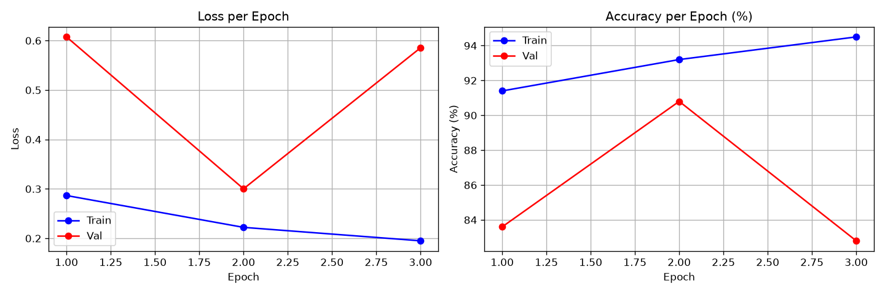
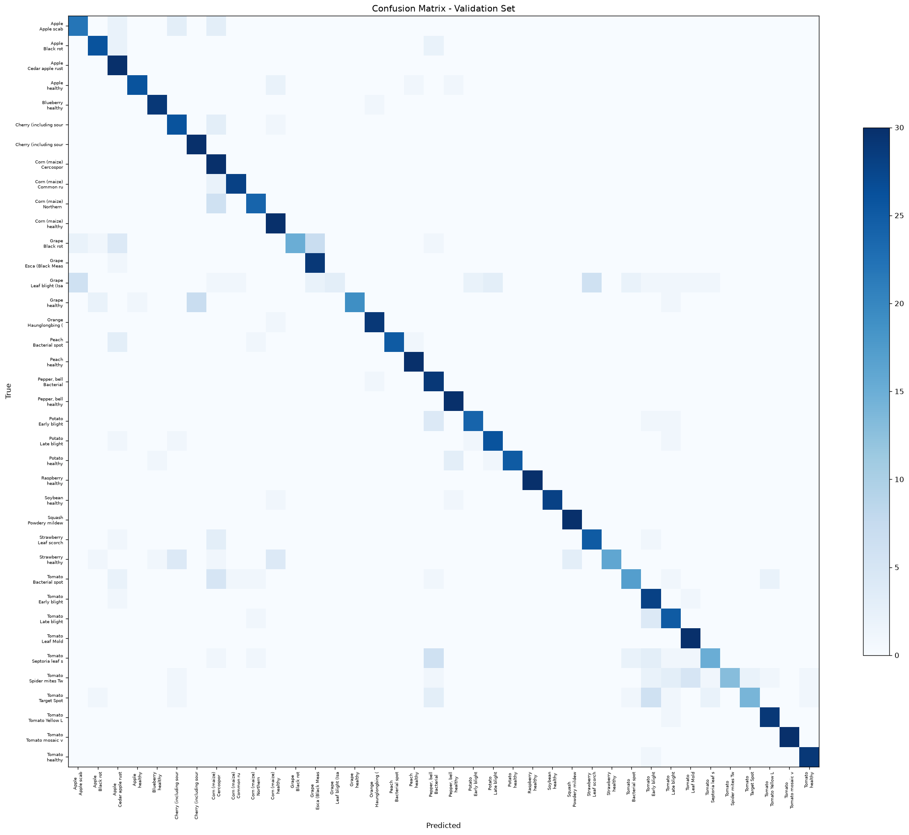

# AgroDoc — AI Crop Doctor for Farmers

> Snap a leaf. Get a diagnosis, a treatment plan, and expert answers — in your language, in seconds.

AgroDoc is a full-stack AI application that lets smallholder farmers photograph a diseased crop leaf and instantly receive a disease diagnosis, step-by-step treatment advice, and a conversational agronomist — all translated into their local language.

---

## Problem Statement

Smallholder farmers lose **20–40% of their annual crop yield** to plant diseases and pests that go undiagnosed until it is too late. The primary bottleneck is access: certified agronomists are concentrated in urban centres, extension services are under-resourced, and a single farm visit can cost more than a week's income. By the time a farmer reaches an expert, the infection has already spread.

The result is a cascading food-security crisis. The farmers who can least afford crop loss are the ones with the least access to the knowledge needed to prevent it.

---

## Solution Overview

AgroDoc puts an AI-powered crop doctor in every farmer's pocket. The workflow is four steps:

1. **Upload** — Photograph or select a leaf image from the gallery.
2. **Diagnose** — A fine-tuned MobileNetV2 model identifies the disease from 38 classes across 14 crops (87.7% validation accuracy).
3. **Treat** — An LLM (via Featherless.ai) generates a structured treatment plan: root cause, treatment steps, organic alternatives, and prevention tips. Urgency is flagged as low / medium / high.
4. **Ask** — A contextual chat interface lets the farmer ask any follow-up question in plain language.

Every piece of advice can be translated into Hindi, Spanish, Swahili, or French with one click.

---

## Key Features

| Feature | Detail |
|---|---|
| AI Diagnosis | 38-class plant disease classification, top-3 confidence bars |
| Confidence Indicator | High / Moderate / Low pill with a photo-quality advisory for uncertain results |
| LLM Treatment Plan | Structured JSON advice: cause, treatment steps, organic options, prevention tips |
| Multi-language | Instant translation (English, Hindi, Spanish, Swahili, French) with client-side cache |
| Contextual Chat | Ask follow-up questions grounded in the current diagnosis |
| Step Progress | 4-step visual flow: Upload → Diagnosis → Treatment → Ask AgroDoc |
| Offline-friendly UX | Results cached in browser; no re-fetch on language re-select |
| Mobile-first Design | Responsive at 375 px; camera capture for in-field use |
| Error Handling | Friendly error banners; backend errors never expose stack traces |

---

## Technologies Used

### Machine Learning
- **PyTorch** — training loop, DataLoader, optimizer (AdamW, lr=2e-5)
- **HuggingFace Transformers** — `MobileNetV2ImageProcessor`, `AutoModelForImageClassification`
- **Base model** — `linkanjarad/mobilenet_v2_1.0_224-plant-disease-identification`
- **Dataset** — PlantVillage (via HuggingFace `datasets`); 6,650 training + 1,140 validation images sampled uniformly across all 38 classes
- **Evaluation** — scikit-learn (`classification_report`, confusion matrix), matplotlib

### Backend
- **FastAPI** — REST API with automatic OpenAPI docs
- **Featherless.ai** — OpenAI-compatible API endpoint, `Qwen/Qwen2.5-7B-Instruct` for advice, batch translation, and chat
- **python-dotenv** — API key management
- **requests** — Featherless HTTP client

### Frontend
- **React 19 + Vite 8** — component-based UI, fast HMR
- **Tailwind CSS v4** — utility-first styling via `@import "tailwindcss"` + `@theme {}` custom tokens
- **framer-motion v12** — page transitions, animated progress bars, loading overlays
- **lucide-react** — icon set
- **Google Fonts** — Playfair Display (headings) + DM Sans (body)

---

## Target Users

- **Primary** — Smallholder farmers in developing regions with a smartphone and basic connectivity
- **Secondary** — Agricultural extension workers who need a fast second opinion in the field
- **Tertiary** — Agronomists and NGO field staff who can use AgroDoc as a training/demonstration tool

---

## Model Performance

Training used best-checkpoint selection: the model is saved whenever validation accuracy improves, and the saved checkpoint is reloaded before final evaluation.

| Metric | Value |
|---|---|
| Validation Accuracy | **87.72%** |
| Macro F1 | **0.8724** |
| Macro Precision | **0.8997** |
| Macro Recall | **0.8772** |
| Training images | 6,650 (175 per class × 38 classes) |
| Validation images | 1,140 (30 per class × 38 classes) |
| Classes | 38 disease/healthy states |
| Crops | 14 (Apple, Blueberry, Cherry, Corn, Grape, Orange, Peach, Pepper, Potato, Raspberry, Soybean, Squash, Strawberry, Tomato) |
| Best epoch | Epoch 2 of 3 (saved by best-checkpoint logic) |

**Strongest classes (F1 = 1.00):** Orange HLB (Citrus greening), Peach healthy, Grape healthy, Raspberry healthy

**Most challenging classes:** Potato Late Blight (F1 0.46 — visually similar to Early Blight), Tomato Early Blight (F1 0.63), Tomato Septoria leaf spot (F1 0.71)

### Training Curves



### Confusion Matrix



---

## Project Structure

```
agro-doc/
└── agrodoc/
    ├── model/
    │   ├── data_prep.py          # Download & sample PlantVillage dataset
    │   ├── train.py              # Fine-tune MobileNetV2, best-checkpoint saving
    │   ├── eval.py               # Standalone evaluation + plot generation
    │   ├── inference.py          # Singleton inference module for FastAPI
    │   └── saved_model/          # Weights, metrics.json, plots (gitignored: data/)
    │       ├── model.safetensors
    │       ├── metrics.json
    │       ├── training_curves.png
    │       └── confusion_matrix.png
    ├── backend/
    │   ├── main.py               # FastAPI app: /predict /advice /translate /chat /health
    │   ├── .env                  # FEATHERLESS_API_KEY (not committed)
    │   └── .env.example
    ├── frontend/
    │   ├── src/
    │   │   ├── App.jsx           # Root state, all API calls, language cache
    │   │   ├── index.css         # Tailwind v4 @theme tokens, @layer base styles
    │   │   └── components/
    │   │       ├── Header.jsx
    │   │       ├── StepProgress.jsx
    │   │       ├── HeroIntro.jsx
    │   │       ├── UploadSection.jsx
    │   │       ├── ResultsSection.jsx
    │   │       ├── TreatmentPlan.jsx
    │   │       ├── ChatBox.jsx
    │   │       ├── AboutModel.jsx
    │   │       └── Footer.jsx
    │   ├── index.html
    │   └── vite.config.js
    └── requirements.txt
```

---

## Setup & Run

### Prerequisites

- Python 3.10+
- Node.js 18+
- A [Featherless.ai](https://featherless.ai) API key

### 1. Clone & install Python dependencies

```bash
git clone <repo-url>
cd agro-doc/agrodoc
pip install -r requirements.txt
```

### 2. Configure the API key

```bash
cp backend/.env.example backend/.env
# Edit backend/.env and set your real key:
# FEATHERLESS_API_KEY=rc_your_key_here
```

### 3. (Optional) Re-run data preparation and training

The trained model weights are included in `model/saved_model/`. Skip these steps unless you want to retrain from scratch.

```bash
# From agrodoc/
python model/data_prep.py   # downloads PlantVillage, samples images to model/data/
python model/train.py        # fine-tunes MobileNetV2 for 3 epochs (~25–40 min on CPU)
python model/eval.py         # regenerates metrics.json, training_curves.png, confusion_matrix.png
```

### 4. Start the backend

```bash
# From agrodoc/backend/
uvicorn main:app --reload --port 8000
```

Health check: `curl http://localhost:8000/health` → `{"status":"ok"}`

### 5. Start the frontend

```bash
# From agrodoc/frontend/
npm install
npm run dev
```

Open [http://localhost:5173](http://localhost:5173) in your browser.

### API Endpoints

| Method | Path | Description |
|---|---|---|
| GET | `/health` | Liveness check |
| POST | `/predict` | Upload image → disease classification + top-3 |
| POST | `/advice` | `{disease_name, crop_name}` → structured treatment plan JSON |
| POST | `/translate` | `{target_language, fields}` → batch-translated treatment plan |
| POST | `/chat` | `{disease_context, question}` → conversational answer |

---

## Future Work

- **Edge / offline deployment** — Export the MobileNetV2 model to TFLite or ONNX for on-device inference; remove the server dependency for regions with no connectivity
- **Expand crop coverage** — The PlantVillage dataset covers 14 crops; add cassava, rice, maize varieties, and legumes that are critical to Sub-Saharan Africa and South Asia
- **Pest identification** — Extend the classifier to recognise insect pests (aphids, stem borers, whitefly) alongside fungal/bacterial diseases
- **Voice interface** — Add speech-to-text input and text-to-speech output for farmers who are not comfortable with typing
- **Integration with agri-extension services** — Push diagnosed cases (with consent) to national plant health surveillance dashboards and extension worker queues
- **Severity scoring** — Beyond detecting disease, estimate how far the infection has spread from the image (early / mid / late stage)
- **Geo-tagged outbreak map** — Aggregate anonymised diagnosis data to surface regional disease outbreak patterns in real time
- **WhatsApp / SMS channel** — Meet farmers on platforms they already use by exposing AgroDoc through the WhatsApp Business API or an SMS gateway

---

## License

MIT
